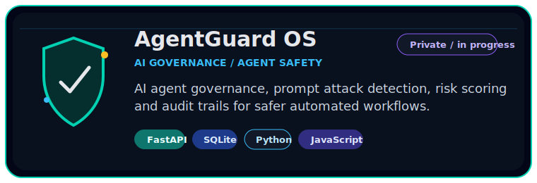
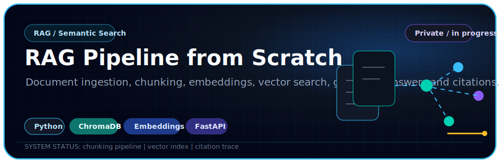
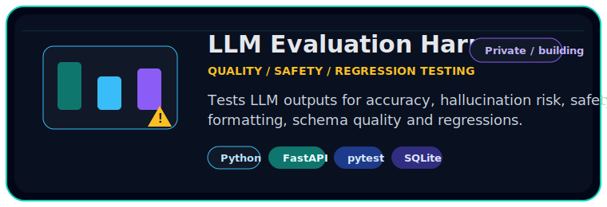
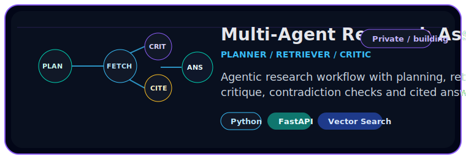
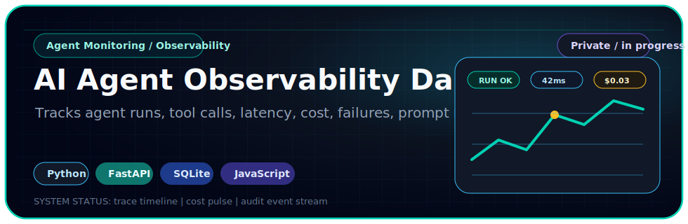
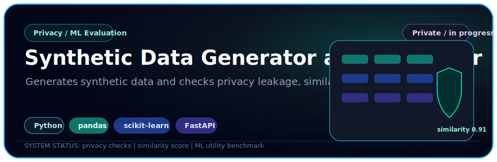
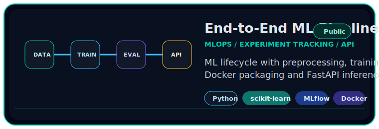
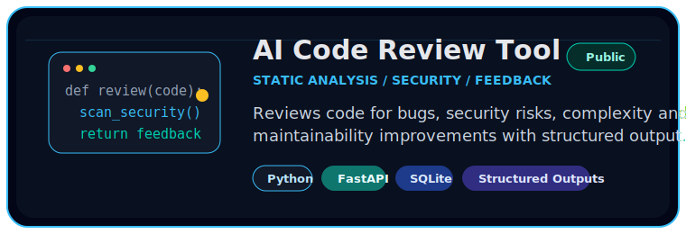
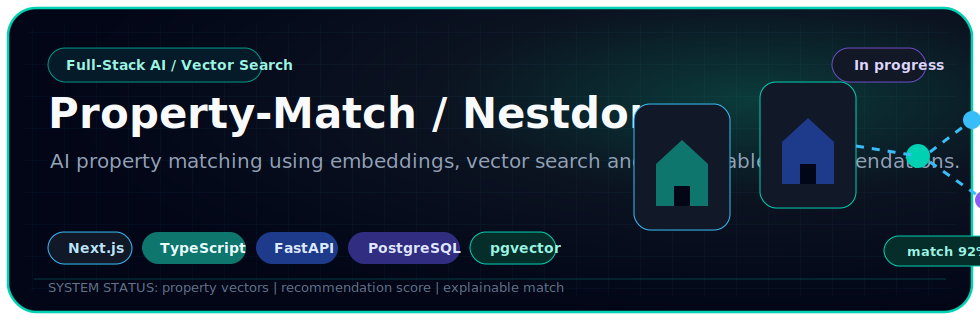

<div align="center">


### First Class AI Graduate · London, UK

### RAG · AI Agents · LLM Evaluation · MLOps · FastAPI · Applied AI Engineering

I build practical AI systems that turn messy workflows, documents and data into useful, testable and safe software.


<br />

[](https://saneeshmorais16.github.io/Saneesh_Portfolio_16/)
[](https://www.linkedin.com/in/saneesh-morais-581458227/)
[](mailto:saneeshmorais@gmail.com)
[](https://github.com/saneeshmorais16?tab=repositories)

</div>

---

## About

I’m **Saneesh Morais**, a London-based **First Class Honours graduate in Computing with Artificial Intelligence Technology**.

I build applied AI systems across **RAG, AI agents, LLM evaluation, MLOps, FastAPI backends, automation workflows and machine learning products**.

My focus is practical AI: systems that are useful, testable, explainable and reliable enough to be evaluated, improved and used responsibly.

---

## What I Build

| Area                        | What I build                                                                                        |
| --------------------------- | --------------------------------------------------------------------------------------------------- |
| **RAG and Semantic Search** | Document ingestion, chunking, embeddings, vector search, grounded answers and citations             |
| **AI Agents**               | Planner, retriever and evaluator workflows with human-in-the-loop review, tool use and traceability |
| **LLM Evaluation**          | Accuracy, relevance, hallucination risk, safety, JSON/schema checks and regression testing          |
| **MLOps**                   | Training pipelines, MLflow tracking, model comparison, FastAPI inference and CI/CD                  |
| **AI Governance**           | Prompt attack detection, risk scoring, audit logs, cost guardrails and circuit breakers             |
| **Applied AI Products**     | FastAPI backends, browser tools, dashboards and automation workflows around real use cases          |

---

## Engineering Direction

```text
Current portfolio direction
├── Build AI systems with real architecture, not just notebooks
├── Add evaluation, tests and monitoring where possible
├── Use FastAPI to turn ML/LLM ideas into usable software
├── Keep projects safe with synthetic data and no private information
└── Make the strongest repositories public after review
```

---

## Featured AI Systems

These projects are designed around what real AI teams care about: **retrieval quality, evaluation, observability, safety, deployment and practical software engineering**.

Some repositories are being cleaned and reviewed before being made public. I only make projects public after checking for secrets, private data and misleading claims.

<div align="center">



<br /><br />



<br /><br />



<br /><br />



<br /><br />



<br /><br />



<br /><br />

<a href="https://github.com/saneeshmorais16/mlflow-end-to-end-ml-pipeline">
  
</a>

<br /><br />

<a href="https://github.com/saneeshmorais16/ai-code-review-tool">
  
</a>

<br /><br />



</div>

---

## Technical Stack

<div align="center">

### AI / ML / LLMs


### Backend / Data


### Product / Frontend


### Delivery / Cloud


</div>

---

## Current Build Track

```text
AI Engineering
|-- RAG systems with citations and grounded answers
|-- Multi-agent workflows with planner / retriever / critic patterns
|-- LLM evaluation for hallucination, safety and formatting
|-- Agent observability, cost tracking and audit logs
|-- MLflow pipelines and FastAPI inference APIs
`-- Applied AI products that solve real workflow problems
```

---

## GitHub Activity

<div align="center">


<br />


</div>

---

## Recruiter Note

If you are hiring for a junior AI/software role, I can bring:

* Practical AI project evidence
* Python, FastAPI and ML workflow experience
* RAG, agents, LLM evaluation and MLOps project focus
* First Class academic performance
* Internship experience across data analysis and applied AI
* Customer-facing work experience showing communication, resilience and work ethic
* High learning speed and strong motivation to grow

---

## What I’m Looking For

I’m open to graduate and junior opportunities in:

* AI Engineering
* Machine Learning Engineering
* LLM / RAG Engineering
* AI Software Engineering
* Applied AI Consulting
* Data / ML Product Engineering

---

## Contact

* Email: [saneeshmorais@gmail.com](mailto:saneeshmorais@gmail.com)
* LinkedIn: [linkedin.com/in/saneesh-morais-581458227](https://www.linkedin.com/in/saneesh-morais-581458227/)
* Portfolio: [saneeshmorais16.github.io/Saneesh_Portfolio_16](https://saneeshmorais16.github.io/Saneesh_Portfolio_16/)

---

<div align="center">

### Building practical AI systems — not just prompts.


</div>
